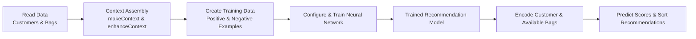
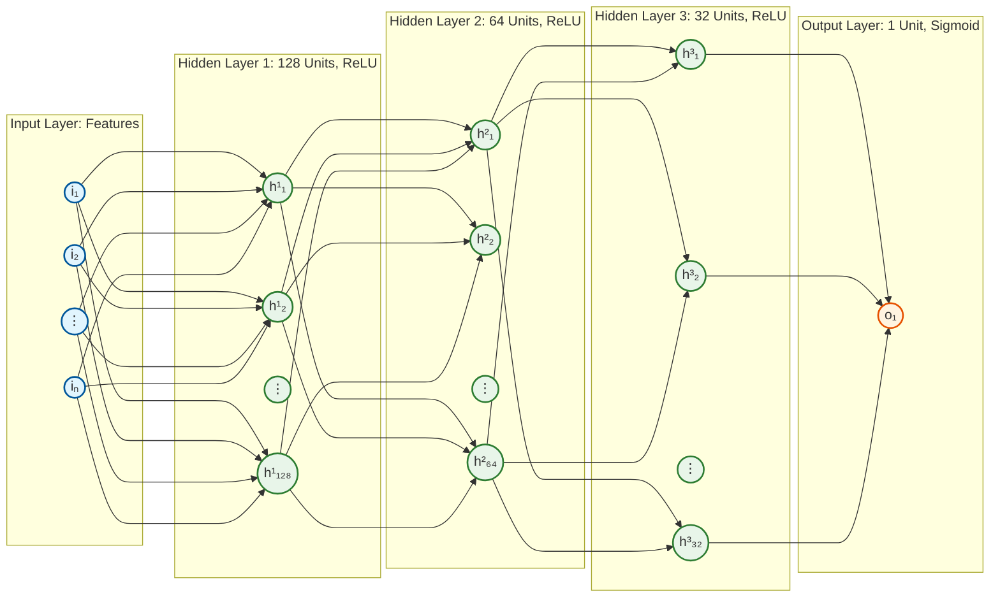

# Bag Recommendation System (Sacolas do Bem)

A specialized recommendation engine designed to suggest the best available surprise bags ("sacolas") to customers based on their historical purchase patterns, average ticket, and preferences.

## 🚀 Motivation & Inspiration

This project was developed as part of the first module of the **Post-graduate program in Applied AI Engineering (Engenharia de IA Aplicada)**. 

The core architecture and logic are based on the concepts presented by **Professor Erick Wendell** during our fundamental sessions on Neural Networks and TensorFlow. This implementation adapts those principles to a specific marketplace domain, focusing on sustainability through surprise bag recommendations.

## 🛠 Features

- **Personalized Recommendations**: Uses a Neural Network built with TensorFlow.js to match customers with available bags.
- **Balanced Dataset Training**: Solves model collapse by dynamically sampling proportional negative examples alongside historical positive purchases.
- **Realistic Data Persona**: Data enriched with realistic names, personas, and establishment identities to simulate a production environment.
- **Asynchronous Training**: Dedicated Web Worker for model training to ensure a smooth, non-blocking UI experience.
- **Custom Visualizer Dashboard**: Uses `tfjs-vis` integrated into a custom responsive bottom sheet for real-time visualization of model loss and accuracy.
- **Dynamic Customer Profiles**: Real-time display of total orders, average tickets, and synchronized history.
- **Code Quality Enforcement**: Fully integrated with ESLint + Prettier for static analysis and automated formatting.

## 🏗 Project Structure

```text
├── data/               # Project database (JSON format)
│   ├── availability.json # Real-time bag availability
│   ├── customer.json     # Enriched customer profiles
│   └── orders.json       # Synchronized historical order data
├── src/
│   ├── controller/      # Application logic coordination
│   ├── events/          # Event-driven communication bus
│   ├── service/         # Data access and business logic
│   ├── view/            # UI components and templates
│   └── workers/         # TensorFlow.js model training worker
├── index.html           # Main entry point (Dashboard)
├── style.css            # Custom UI styling
└── package.json         # Dependencies and scripts
```

## 💻 Tech Stack

- **Core**: JavaScript (ESM)
- **Machine Learning**: [TensorFlow.js](https://www.tensorflow.org/js)
- **UI & Styling**: HTML5, Vanilla CSS, Bootstrap 5
- **Development Server**: Browser-Sync

## 🏁 Getting Started

### Prerequisites

- [Node.js](https://nodejs.org/) (Version 18+ recommended)
- [npm](https://www.npmjs.com/)

### Installation

1. Clone the repository:
   ```bash
   git clone https://github.com/kayran/bag_recomendation.git
   cd bag_recomendation
   ```

2. Install dependencies:
   ```bash
   npm install
   ```

3. Start the development server:
   ```bash
   npm start
   ```

The application will automatically open in your browser at `http://localhost:3000`.

## 🧠 Technical Overview

The system encodes categorical data (segments, categories, bag types) into numerical tensors. The model is a multi-layer perceptron (MLP) that learns customer behavior by correlating their historical metrics ("Average Ticket", "Quantities", "Feedback Scores") with specific bag features. 

To prevent neural network optimization collapse, the system structures the context by actively balancing the dataset with positive labels (actual purchases) and a proportionate number of negative labels (random unpurchased bags). Training occurs in the background via `modelTrainingWorker.js` to prevent UI thread blocking, seamlessly passing the predictions back for sorting the recommendation feed.

### Data Processing Flow



### Neural Network Architecture



### How the Recommendation Model Works

1. **Input Layer**: It acts as the gateway for our contextual data, receiving a dynamically generated 1D Tensor that concatenates the customer's historical profile metrics with an available bag's specific encoded features (price, feedback scores, category, type, and segment).
2. **Hidden Layers (MLP)**: The model utilizes a deep feed-forward multi-layer perceptron architecture. Three dense hidden layers (comprising 128, 64, and 32 computational units, respectively) utilize the `ReLU` (Rectified Linear Unit) activation function. These layers serve to extract complex, non-linear relationships and behavioral patterns between what a customer typically purchases and the characteristics of the suggested bags.
3. **Output Layer**: A final dense layer narrows the computation down to a single output unit using a `Sigmoid` activation function. This produces a final continuous probability score between 0 and 1, representing the model's confidence that the customer will purchase this specific bag. The application then uses these scores to rank and sort the recommendations from highest to lowest relevance.

---
*Developed for academic purposes in the Engenharia de Software com IA Aplicada program.*
